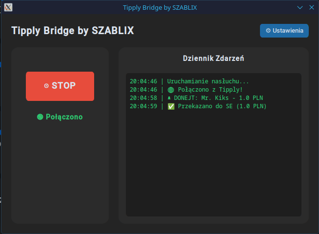

#  Tipply Bridge by SZABLIX

**Tipply Bridge** to lekki, niezawodny i nowoczesny program działający w tle, który w czasie rzeczywistym przechwytuje wpłaty z platformy **Tipply** i natychmiastowo przekazuje je do **StreamElements**.

Zbudowany z myślą o streamerach, którzy chcą używać alertów StreamElements przy jednoczesnym używaniu polskiej platformy Tipply.

## ✨ Główne funkcje

* ⚡ **Zero Opóźnień (WebSockets):** Program łączy się bezpośrednio z serwerami Tipply z pominięciem przeglądarki. Powiadomienia wpadają ułamek sekundy po wysłaniu donejta.
* 🪶 **Ekstremalnie lekki:** Zapomnij o starych skryptach używających Selenium i Chromium. Tipply Bridge zużywa ułamek procenta procesora i pamięci RAM.
* 🎨 **Nowoczesny Interfejs (Dark Mode):** Eleganckie, gamingowe GUI zbudowane na CustomTkinter.
* 👻 **Działanie w tle (System Tray):** Kliknij "X", aby ukryć program w zasobniku obok zegarka. Będzie cicho pracował w tle, nie zaśmiecając paska zadań.
* 🛡️ **Bezpieczeństwo:** Twoje wrażliwe tokeny (JWT, Account ID) są zapisywane w bezpiecznym, ukrytym folderze systemowym, a nie w zwykłym pliku tekstowym obok programu.
* 🪄 **Inteligentny Kreator Konfiguracji:** Pierwsze uruchomienie to prosty przewodnik krok po kroku. Wklej cały link z Tipply, a program sam wytnie z niego odpowiedni token!

## 📸 Zrzuty ekranu

Ekran donatezanyzanyzany:

Przekazany donate w StreamElements, zakładka Revenue history
! [rzekazany donejt w SE](Screenshot_20260422-225036_Chrome.png)

## 🚀 Jak zacząć? (Dla użytkowników Windowsa)

Nie musisz znać się na programowaniu ani instalować Pythona!
1. Przejdź do zakładki **[Releases](../../releases)** po prawej stronie.
2. Pobierz najnowszy plik `TipplyBridge_Windows.exe` (działa również na Linuxie - użyj Wine).
3. Uruchom program i postępuj zgodnie z instrukcjami na ekranie, aby podać swoje tokeny.
4. Kliknij **START** i ciesz się połączonymi systemami!

## 🐧 Uruchamianie na systemie Linux

Ze względu na kaprysy nowoczesnych środowisk Linuxowych w obsłudze zasobnika systemowego (Tray), oficjalnie wspieraną i polecaną wersją jest plik `.exe`. 

Dzięki warstwie kompatybilności **Wine**, użytkownicy Linuxa mogą odpalić ten program równie łatwo co na Windowsie, bez wpisywania skomplikowanych komend!

**1. Szybka instalacja Wine:**
Jeśli jeszcze nie masz Wine, otwórz na moment terminal i wklej jedną z poniższych komend, zależnie od Twojego systemu:

* **Arch Linux / CachyOS / Manjaro:** `sudo pacman -S wine`
* **Debian / Ubuntu / Linux Mint:** `sudo apt install wine`
* **Fedora:** `sudo dnf install wine`

**2. Uruchomienie programu (Prościej się nie da!):**
1. Pobierz gotowy plik `.exe` z zakładki **Releases**.
2. Otwórz swój folder z Pobraniami.
3. Kliknij na plik prawym przyciskiem myszy i wybierz **"Otwórz za pomocą: Wine"** (lub na niektórych systemach po prostu **kliknij go dwa razy**!).

Gotowe! Program otworzy się normalnie, a ikonka będzie bez problemu chować się do paska zadań.

